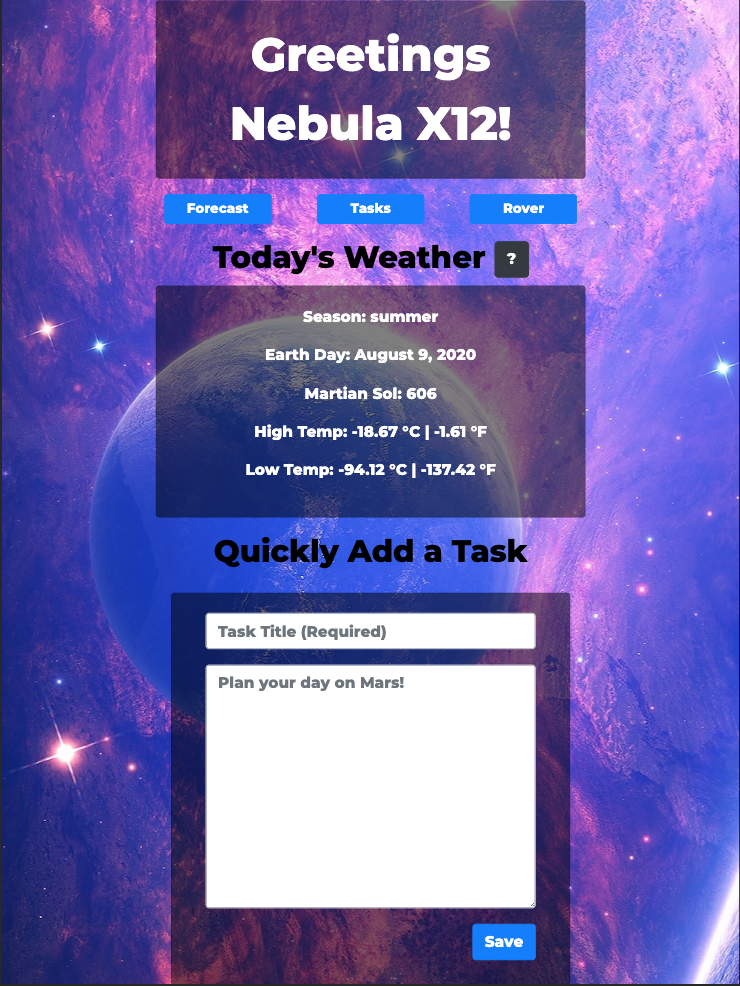
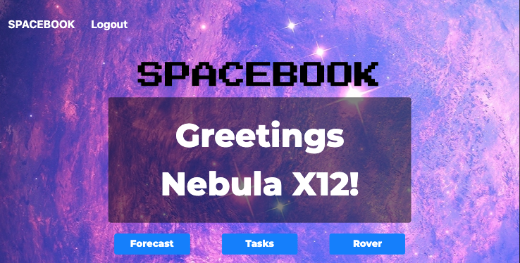
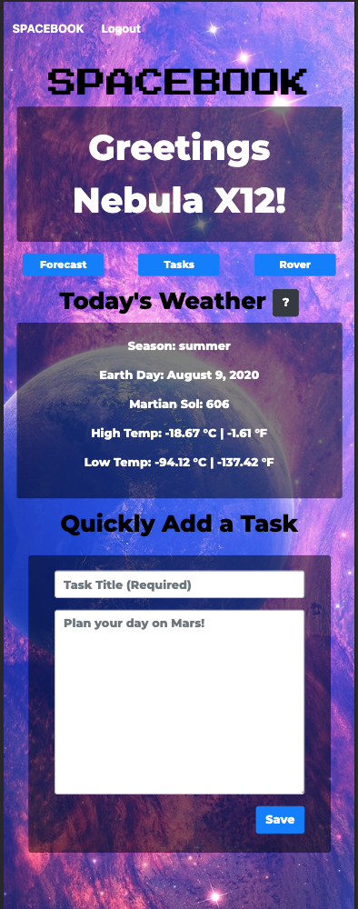
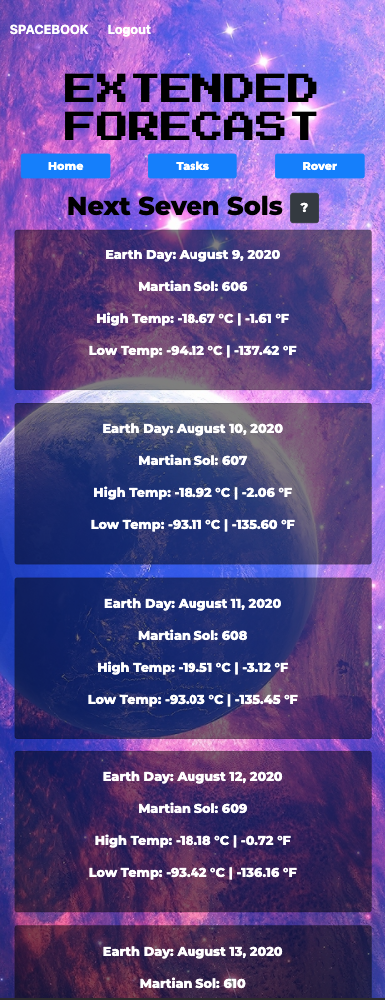
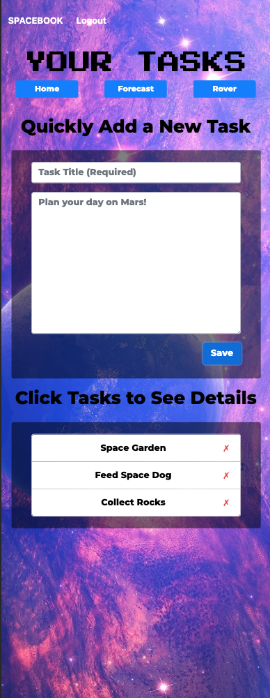
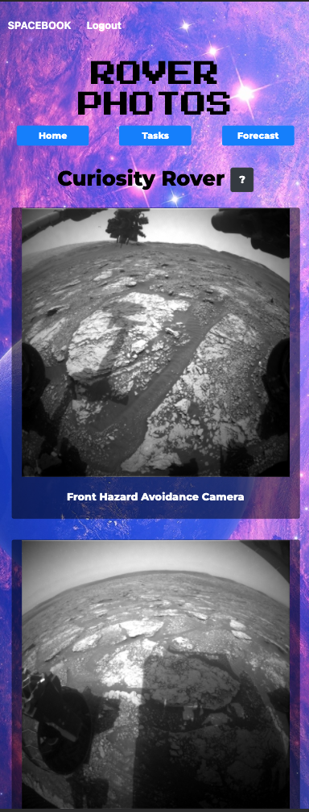
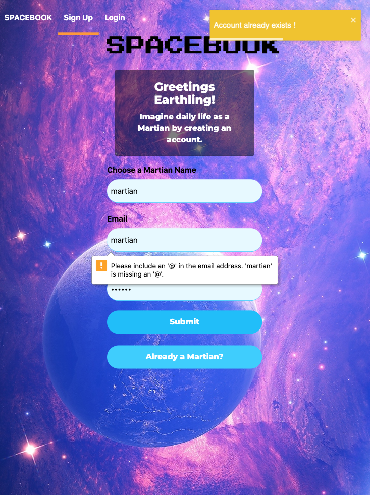
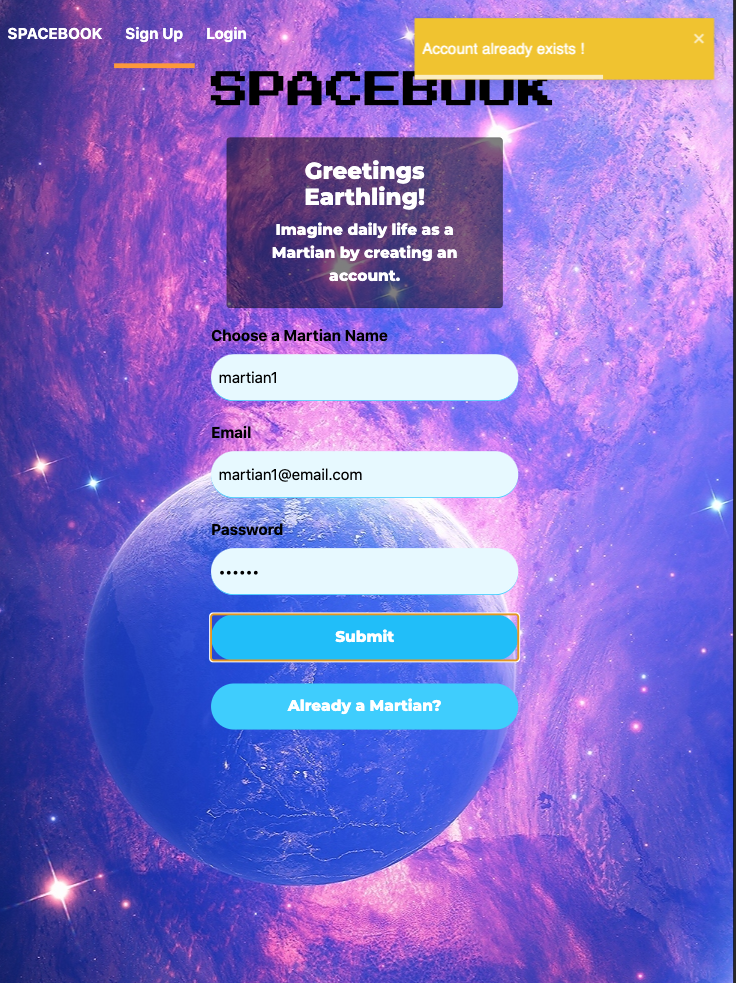
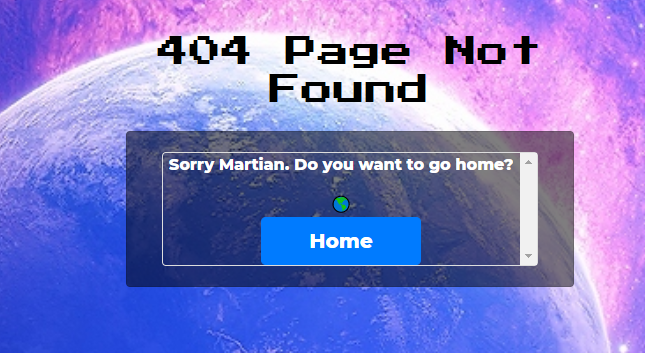

# SPACEBOOK
[](https://opensource.org/licenses/MIT)

🚀[Deployed on Heroku: https://spacebook-mars.herokuapp.com/](https://spacebook-mars.herokuapp.com/)

## Description:  
 The year is 2099. Humans now live in a colony on Mars. They need an app to help them plan their day. 
 
SPACEBOOK allows Martians to see the current weather for their colony location, check on photos from the nearby rover, and manage a task list. 

For future development: Martians will be able to connect with other Martians to share tasks, alert to weather conditions, and save Rover photographs. 

## Table of Contents:
* [Developers](#developers)
* [Installing Locally](#installing-locally)
* [Quick Start](#quick-start)
* [Usage](./USAGE.md)
* [ScreenShots](#screenshots)
* [Tests](./Tests)
* [License](#license)

# Developers
These Earthlings enjoyed imagining life as Martians:

* **Lisbeth Machado**
* :octocat: [GitHub](https://github.com/lisbethmachado)
* 📧 E-mail: 

* **Timothy Lam**
* :octocat: [GitHub](https://github.com/tlam1288)
*  📧 E-mail: tlam1288@gmail.com

* **Jessica Blankemeier**
* :octocat: [GitHub](https://github.com/jessicablank)
*  📧 E-mail: jessicablankemeier@gmail.com

# Installing Locally

Add a .env file at the top level of this project.

Then inside of the .env add a SERVER_SECRET set to any value you'd like

```
SERVER_SECRET = 123456
```

First off make sure you have a local version of MongoDB running on your machine. This project will make a local database for you called `appDB`.

```
mongod
```

Start by installing front and backend dependencies. While in the root directory, run the following command:

```
npm install
```

After all installations complete, run the following command in your terminal:

```
npm start
```

That's it, your app should be running on <http://localhost:3000>. The Express server should intercept any AJAX requests from the client.

# Quick Start
These Martians are already registered with populated task lists if the User would like to test the application without creating a new Martian. 

* Test User 1

    * Martian Name: Mr. Martian XLF-12
    * Email: Mars.Rocks@email.com
    * Password: p@ssw0Rd

* Test User 2

    * Martian Name: Ms. Martian XLF-15
    * Email: Martians.Rocks@email.com
    * Password: p@ssw0Rd

# Screenshots

Web Application View Signup Page:


Web Application View Login Page:


Tablet Application View Home Page:



Tablet Application View Home Banner:



Phone Application View:

Home Page:



Weather Page:



Task Page:



Rover Page:



Inavlid Signup:



Invalid Login:



No Match Page:



## License
Copyright 2020 - present Lisbeth Machado, Timothy Lam, Jessica Blankemeier.
This project is licensed under the terms of the MIT license. 
More information is available at [opensource.org/licenses](https://opensource.org/licenses/MIT)
