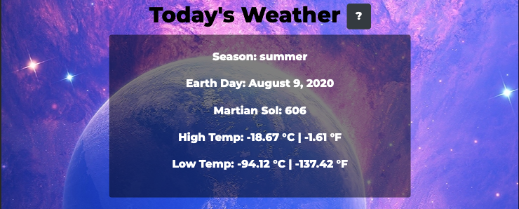
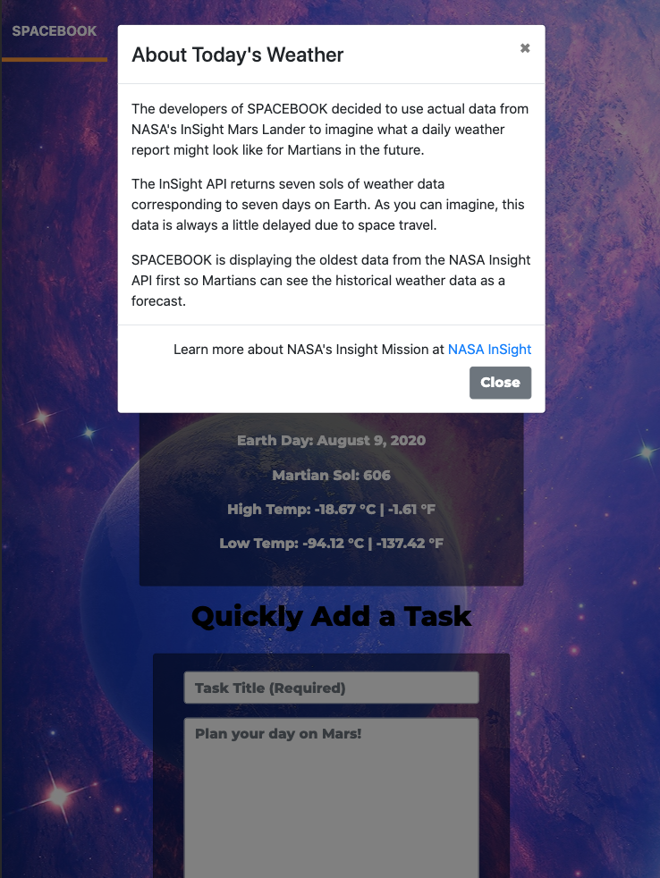
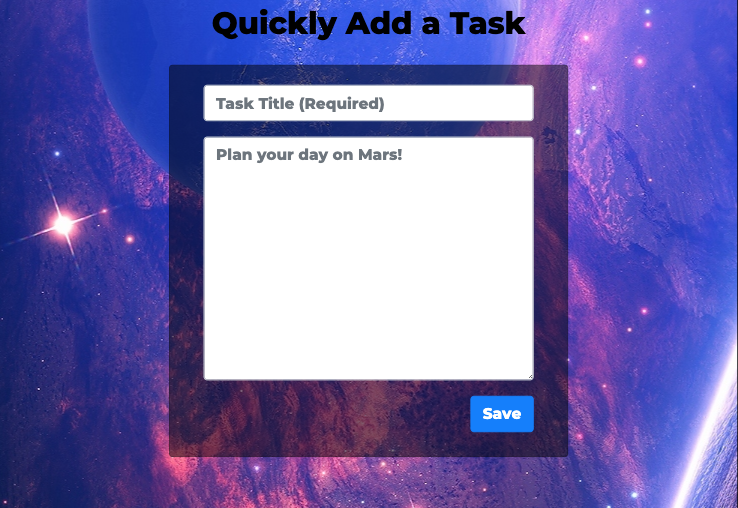
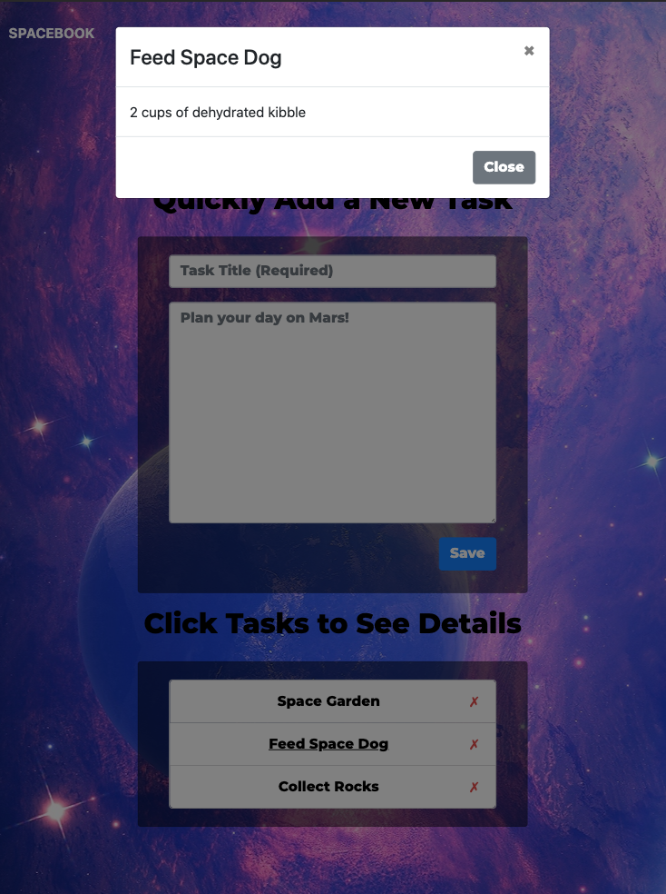
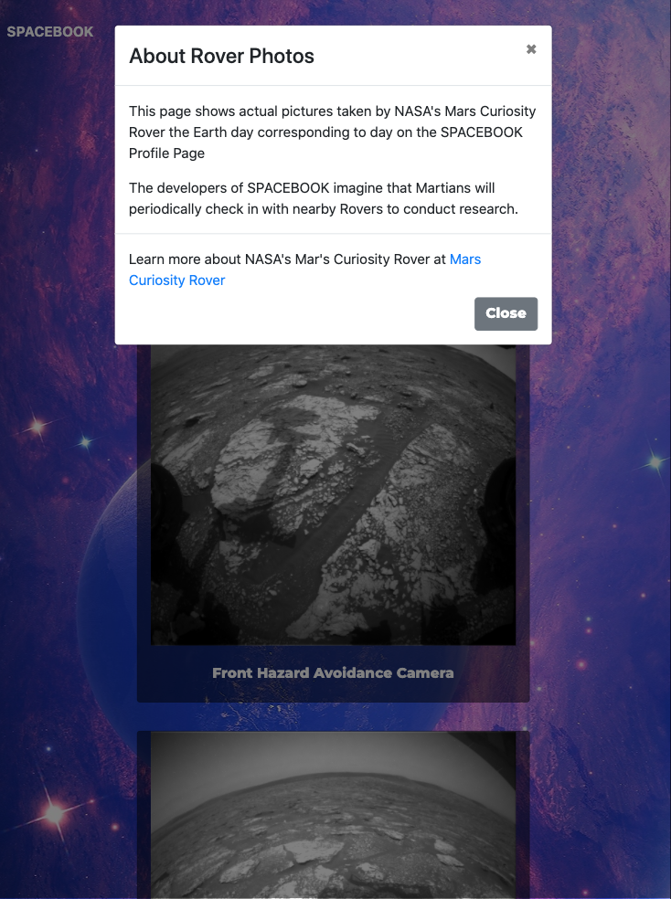

# SPACEBOOK

🚀[Deployed on Heroku: https://spacebook-mars.herokuapp.com/](https://spacebook-mars.herokuapp.com/)

## Description:  
 The year is 2099. Humans now live in a colony on Mars. They need an app to help them plan their day. 
 
SPACEBOOK allows Martians to see the current weather for their colony location, check on photos from the nearby rover, and manage a task list. 

Ideas for future development include Martians connecting with other Martians to share tasks, alert to weather conditions, and share Rover images. 

## Table of Contents:
* [Developers](#developers)
* [Quick Start](#quick-start)
* [Installing Locally](./LOCALINSTALL.md)
* [Usage & Tests](./USAGE.md)
* [ScreenShots](#screenshots)
* [Technologies Used](#Technologies-Used)
* [File Structure](./FILES.md)
* [API EndPoints](./API.md)
* [License](#license)

# Developers
These Earthlings enjoy imagining life as Martians. Please feel free to reach out with questions or comments. 

### Lisbeth Machado
* :octocat: [GitHub: https://github.com/lisbethmachado](https://github.com/lisbethmachado)
* 📧 E-mail: lizmachado.xo@gmail.com

### Timothy Lam
* :octocat: [GitHub: https://github.com/tlam1288](https://github.com/tlam1288)
*  📧 E-mail: tlam1288@gmail.com

### Jessica Blankemeier
* :octocat: [GitHub: https://github.com/jessicablank](https://github.com/jessicablank)
*  📧 E-mail: jessicablankemeier@gmail.com

# Quick Start

These Martians are already registered on the 🚀[deployed site](https://spacebook-mars.herokuapp.com/) with populated task lists if you would like to test the application without creating a new Martian. 

* Test User 1

    * Martian Name: Mr. Martian XLF-12
    * Email: Mars.Rocks@email.com
    * Password: p@ssw0Rd

* Test User 2

    * Martian Name: Ms. Martian XLF-15
    * Email: Martians.Rocks@email.com
    * Password: p@ssw0Rd

# Screenshots

Web Application Views Signup Page:

Web Application Views Login Page:

Home Page:

Home Banner:

Home Weather:

Weather Info:

Weather Page:

Home Task:

Task Page:

Task Info:

Rover Page:

Rover Info:

Inavlid Signup:

Invalid Login:

No Match Page:

## Technologies Used
* [React](https://reactjs.org/)
* [React-bootstrap](https://react-bootstrap.github.io/)
* [Heroku - Deployment](https://www.heroku.com/)
* [Postman- Route Testing](https://www.postman.com/)
* [Travis CI](https://travis-ci.org/)
* [MockFlow Wireframe](https://www.mockflow.com/)

## License
Copyright 2020 - present Lisbeth Machado, Timothy Lam, Jessica Blankemeier.
This project is licensed under the terms of the MIT license. 
More information is available at [opensource.org/licenses](https://opensource.org/licenses/MIT)
